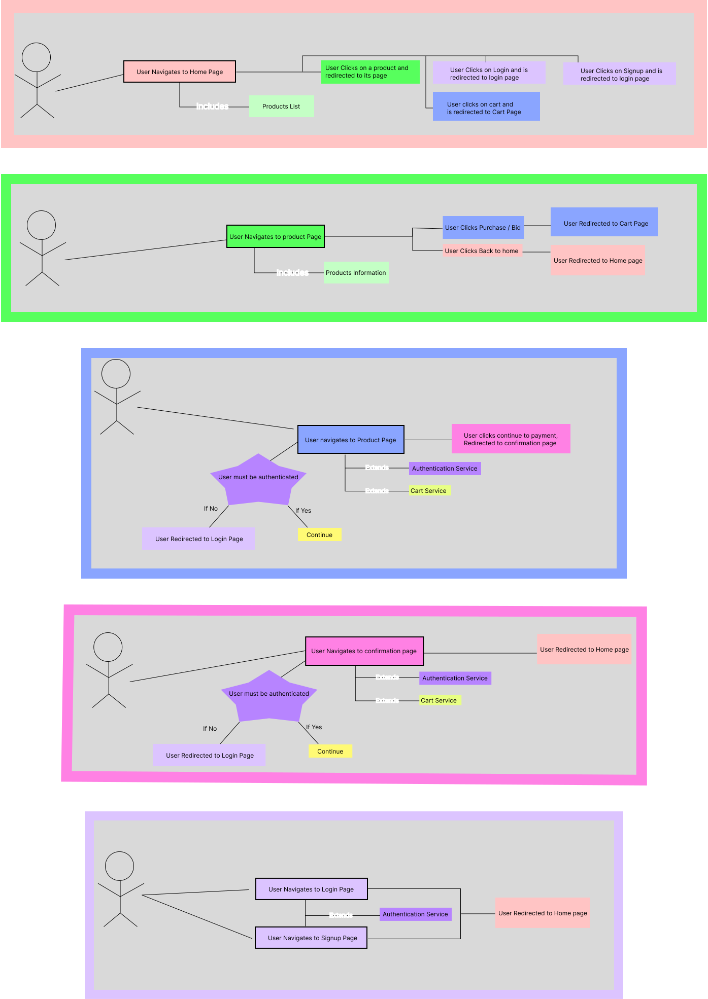
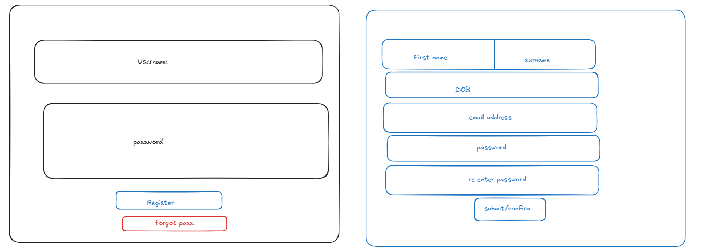
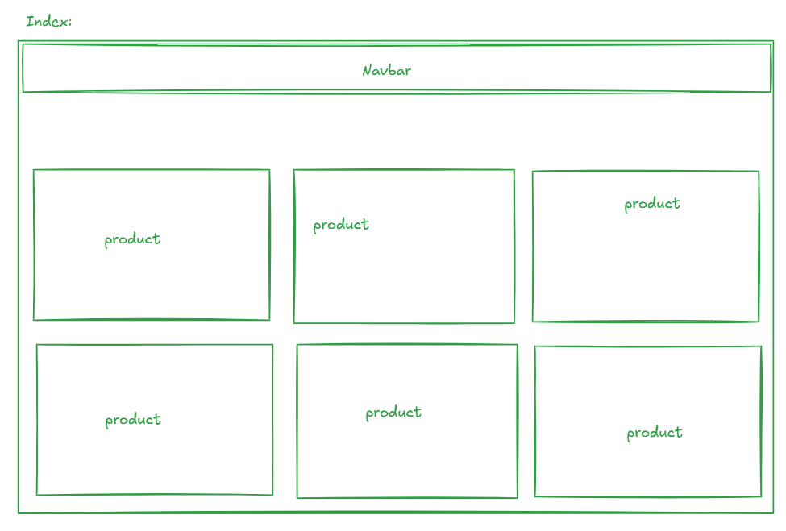

# Software Engineering and Testing. BSC Year 2
### 2024/2025

#### Assessment 2: Requirements Document
**Submitted by:** B00159753, B00143661, B00158966

---

## Declaration
**WE** herby certify that this material, which I now submit for assessment on the
programme of study leading to the award of Ordinary Degree in Computing in the
Institute of Technology Blanchardstown, is entirely my own work except where
otherwise stated.

---

# Ebaí
#### General Public Auctioning and Seller Site

### 1. Project Overview 

The software project we are developing is a Euro-centric e-commerce and auctioning site that will allow users to register as shoppers or sellers. We split the project into front-end and back-end components. The front-end handles the templates and route handling, and the back-end package handles the database interaction and API. The site is not currently using the back-end package.

Any person can use the site; however, they must register to purchase or sell any item. Unauthenticated users can view products and seller information.

### 2. Document Revision

Revision 1 14/02/2025

### 3. Scope
The scope of Phase 1 will be much narrower than that of the final phase. However, a few things will remain permanently out of scope.

We **WILL NOT** be implementing the following:
- An actual payment processing system.
- Adding a review or comment system.
- Account recovery.
- Refunds and cancellations.
- Order Tracking.
- Inventory Managment.
- Advanced search filters.
- Listings cannot be modified or deleted.

We **WILL** be implementing the following: 
- Customizable User Account(Buyer/Seller)
- Auctions / Buy Now
- Wishlist
- Cart
- Sorting by broad category(eg:Electronics,clothing)

### 4. Walkthrough Scenarion
A user clicks a link to site. They arrives at the index page which display a nav bar on top and products on sale. The nav bar has three four links to the the home page, login page, register page and cart. The order see a tile of a product he wishes to buy. They click on it and is taken to the product details page. He sees the product image, description and price. There is a add-to-cart and wishlist button. They click the add to cart button and click on the cart tab. They are taken to the cart page with a list of items in their cart. They click the order button are take to a page that summarises their order. 

## 5. Software Requirements Analysis

### 5.1 User Requirements
In order to sell or buy the user needs an account.
#### 5.1.1 Login
- Username
- Password
#### 5.1.2 Register
- Name
- DOB
- Email
- Password
- User or Buyer
### 5.2 System Requirements
- DB(MySQL)
- PHP
- HTML
- Twig

### 5.3 Non-functional Requirements
- 404 error page
- Order Summary page
- CSS
- Tailwind CSS

### 6 Graphical User Interface Design

#### Product page

### #Login/Register Page

#### Index Page

### 7. Technical Requirements and Feasibility
- Databases to record products and user information
- PHP to interact with the database using CURD
- HTML for structure
- Tailwind CSS for styling
- Twig for templating

### 8. Conclusion

