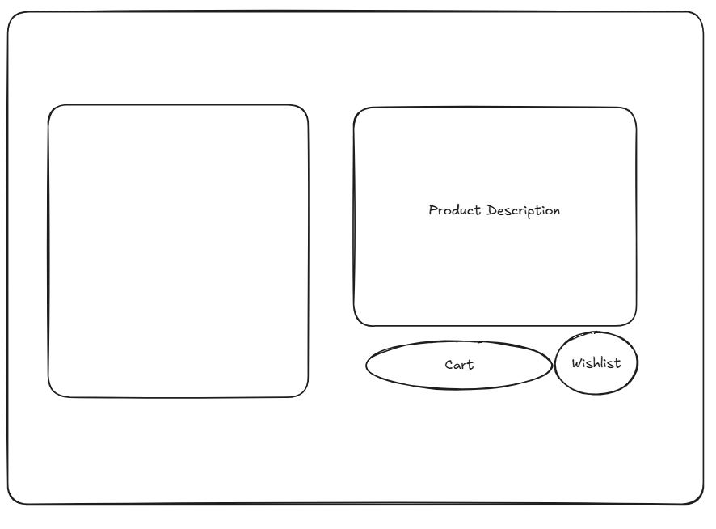

# Software Engineering and Testing. BSC Year 2
### 2024/2025

#### Assessment 2: Requirements Document
**Submitted by:** B00159753, B00143661, B00158966

---

## Declaration
**WE** herby certify that this material, which I now submit for assessment on the
programme of study leading to the award of Ordinary Degree in Computing in the
Institute of Technology Blanchardstown, is entirely my own work except where
otherwise stated.

---

# Ebaí
#### General Public Auctioning and Seller Site

### 1. Project Overview 

The software project we are developing is a Euro-centric e-commerce and auctioning site that will allow users to register as shoppers or sellers. We split the project into front-end and back-end components. The front-end handles the templates and route handling, and the back-end package handles the database interaction and API. The site is not currently using the back-end package.

Any person can use the site; however, they must register to purchase or sell any item. Unauthenticated users can view products and seller information.

### 2. Document Revision

- Revision 1 14/02/2025
- Revision 2 21/02/2025
- Revision 3 22/02/2025

### 3. Scope
The scope of Phase 1 will be much narrower than that of the final phase. However, a few things will remain permanently out of scope.

We **WILL NOT** be implementing the following:
- An actual payment processing system.
- Adding a review or comment system.
- Account recovery.
- Refunds and cancellations.
- Order Tracking.
- Inventory Managment.
- Advanced search filters.

We **WILL** be implementing the following: 
- Customizable User Account(Buyer/Seller)
- Auctions / Buy Now
- Wishlist
- Cart
- Sorting by broad category(eg:Electronics,clothing)
- Add, Update and Delete products

### 4. Walkthrough Scenarion
A user clicks a link to site. They arrives at the index page which display a nav bar on top and products on sale. The nav bar has four links. They are to the the home, login, register and cart page. The user sees a tile of a product they wishes to buy. They click on it and are taken to the product details page. They sees the product image, description and price. There is a add-to-cart and wishlist button. They click the add to cart button and click on the cart tab. They are taken to the cart page with a list of items in their cart. They click the order button are take to a page that summarises their order. 

## 5. Software Requirements Analysis

### 5.1 User Requirements
In order to sell or buy the user needs an account.
#### 5.1.1 Login
- Username
- Password
#### 5.1.2 Register
- Name
- DOB
- Email
- Password
- User or Buyer
#### 5.1.3 Product Listing
- name
- description
- sale type
- price
### 5.2 System Requirements
- DB(MySQL)
- PHP
- HTML
- Twig
#### Use Case Diagram

#### Use Case Specification

##### Index Page
- Anyone can see the index page.
- Nav Bar on top with products on sale displayed.

##### Register Account
- Guest must enter their name, date of birth, email address, and a password to create an account.
- User selects if they are a buyer or seller.
- System verifies if the account is unique.
- System stores details in the database (name, email, password, etc.).
- System confirms account is created.

##### Login
- User must enter their username (may or may not be email) and password to log in.
- System makes an authentication request to the database to verify the credentials.
- Authentication is successful, and the system grants access to the user's account.
- User is redirected to the home page.

##### Browse & Search
- User browses for products. Can use a broad filter.
- Can use the search bar for product name.

##### Product Description
- User can click on any item to view product details, images, and sales information.
- User can add the item to their cart or wishlist.

##### Create/Modify Listing (Sellers)
- Seller logs into their account to create a new listing.
- Seller provides item details (title, description, images, price).
- Seller selects whether the item is part of an auction or fixed-price sale.
- System stores the listing in the database.
- Listing becomes available for buyers to view.

##### Wishlist
- User can add products to their wishlist by clicking the "Add to Wishlist" button.
- Wishlist is stored in the database for the user.
- User can view items from the wishlist at any time.
- System allows users to move items from wishlist to cart when ready to purchase.

##### Cart
- User can add items to their cart with an option to modify quantities or remove items.
- System calculates the total price of the items in the cart and shows the summary.
- User proceeds to checkout and confirms their order.

##### Order Summary
- User is shown a summary of their order.
- Redirected to Index page.

### 5.3 Non-functional Requirements
- 404 error page
- Order Summary page
- CSS
- Tailwind CSS

### 6 Graphical User Interface Design

#### Product page

### #Login/Register Page

#### Index Page

### 7. Technical Requirements and Feasibility
- Databases to record products and user information
- PHP to interact with the database using CURD
- HTML for structure
- Tailwind CSS for styling
- Twig for templating

### 8. Conclusion
Phase 1 focuses on providing core functionalities such as user registration, login, sample of product listing, shopping cart, and product listing by sellers. The system aims to be user-friendly, enabling easy access for both buyers and sellers to interact and conduct transactions. Features such as customizable user accounts, advanced product categorization, payment,reviews and refunds are outside the scope.

The system will be built using web technologies such as PHP, MySQL, HTML, Tailwind CSS and Twig, ensuring a scalable solution. As we progress with the implementation further changes will be made to ensure the platform meets the needs of users and provides a seamless experience.
