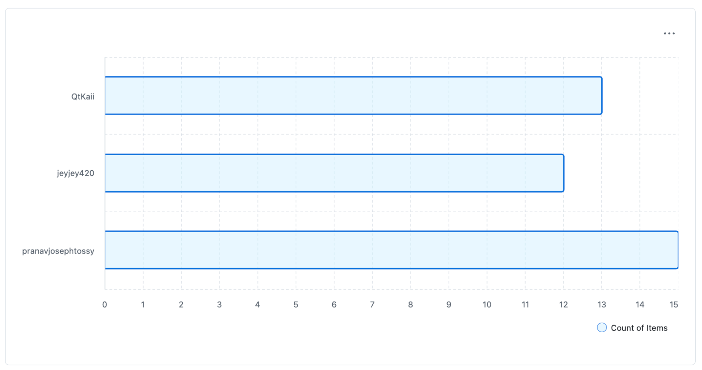

# README

Since one of us, Kai, was an experienced developer we decided to lean on his experience. We used concepts that were not covered in the lectures. This include using twig for templating webpages, and uploading images for products.
We used index.php as a "main" part, used primarily for routing to other pages, creating or calling classes and passing on information like session,classes and db to webpages. Given Kai's experience we followed his guidance. He went throught with us on how we use twig and github. He also taught us how to use sqlite which was a far more convinent way to used databases. We used templates for css as well to give our website and overall professional look.

Lecturer(Robert) let us know that we could use sqlite as long as we have atleat one instance of using PDO. PDO was used in commentDB.php.

## Context On Kais Knowledge (By Kai)

I have been programming in a variety of languages since I was 12, which has been 7 years. My experience spans across JavaScript, TypeScript, Python, Java, C#, Rust, and Go. I am familiar with writing robust systems that can be applications, libraries, or even APIs. Additionally, I possess extensive knowledge of web technologies and browser support. This diverse background has equipped me with a comprehensive understanding of software development across different platforms and paradigms.

I have worked in senior positions in companies, as well as the lead engineer in two. Which has also helped me sharpen my skillset, and introduce me to team management skills which I had not had to the extent I had when I was much younger.

## Worksplit

The graph refers to the issues each member did on github not the actuall work. Something we were cautious throughout this project was the worksplit between the three members. This is because we didn't want Kai, our more experienced member to have an unfair amount of work to do. The programming was evenly split between the three of us(33% each). 

To see detailed contribution by each member check the projects tab in Github. You can see who worked on what issue and when.

## Tools used
- Twig
- Tailwind
- sqlite
- vsc(including extentions to view .sqlite and .md files)
- Github

## References
### PDO sqlite3
Learning sqlite pdo parameters 
- 1 'https://teamtreehouse.com/community/pdo-sqlite'
- 2 'https://www.if-not-true-then-false.com/2012/php-pdo-sqlite3-example/'
- 3 'https://www.php.net/manual/en/pdostatement.bindvalue.php'

## Submission Checklist based on Rubric
- Structure
- CRUD
- Output/Formatting
- Validation
- Data Storage
- Login Logic
- Sessions
- Design
- Code 
- Uni Testing

