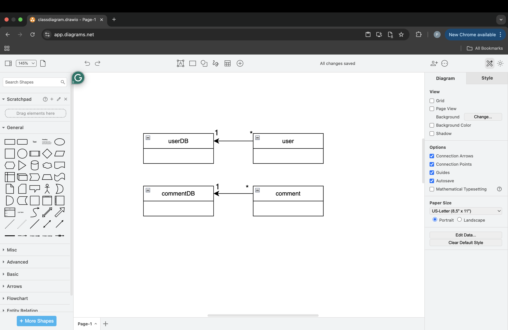
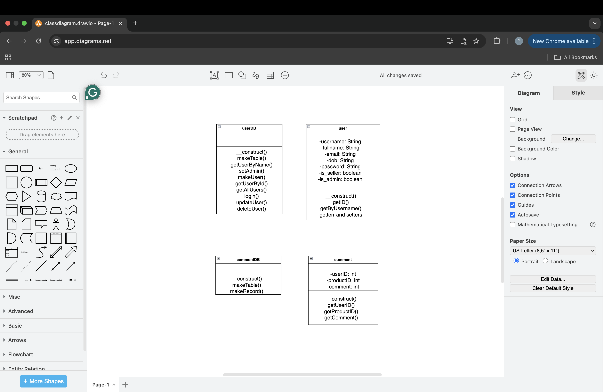
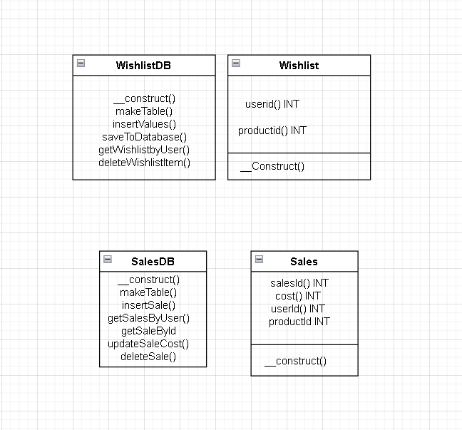
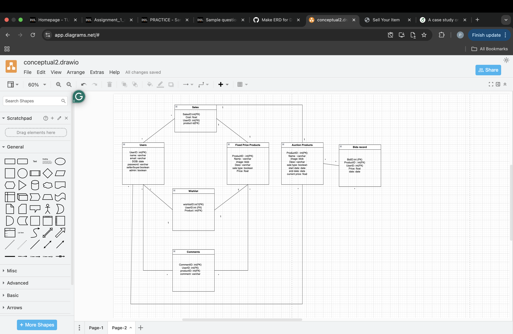

# SET Design and Draft Document

## Abstract / Executive Summary
This document will show the design methodology for our e-commerce platform. The site includes features such as auction sale, fixed pricing sale, user registration, cart management, wishlists, comments, and classes for users, products, sales, and bids. The document covers database design with ERD, and class diagrams.

## 1. Project Definitions

### Purpose of document
To define the design draft for an e-commerce platform. It includes system models, class and entity relationship diagrams.

### What is the project?
The project is an e-commerce website that allows users to buy and sell products. It supports both fixed-price and auction-style selling. Users can interact with products by adding them to their wishlist, cart, and order. The system will manage user registration, product listings, comments, and bids. Admins are able to edit and delete user, product, wishlist and comments(from db).

### Functional Specifications
- Admin functionality
#### Classes and DB
- Comments
- Users
- Wishlists
- Sales
- Products

### Main components of the software system
- Buyer: Can buy products, wish list and order
- Seller: Can list products
- Admin: Can edit and delete tables
- Products: Items for purchase through fixed price sale or auction
- Sales/Bids: Records of transactions, including bids on auction-style items
- Comments: Feedback left by users for products
- Wishlist: A list of products that a user desires to buy

## 2. Document Revision

- Rev. 1.0 21-3-2025 – Draft version
- Rev. 1.1 23-3-2025 - Added diagrams, filled in all sections

## 3. Methodology

### OOAD
OOAD is needed for this project because the methodology is able to break down concepts like users, comments, products, wishlist to models with set parameteres. These models are reusable. Provice a layer of safety to prevent users from directly interactiong with db.
Classes breakdown a "concept" into modules of information.
### ERD
A visual representation of the final db structure for each table. It helps show columns and data required for table.

## 4. Requirements

### 4.1 Use Cases
- User Registration: A user creates account by providing personal information. Info stored in user class. Obj stored in db.
- User Login: User logs in using username and password. Calls db to verify.
- Wishlist: User adds to wishlist. Info stored in wishlist class. Obj stored in db.
- Comments: User leaves comment. Info stored in comments class. Obj stored in db.
- Products(both fixed and auction): Seller lists product. Info stored in products class. Obj stored in db.
- Sale: Upon order info stored in slaes class. Obj stored in db.
- Bids: Upon bid placed info stored in bids class. Obj stored in db.

## 5. Case Diagrams

### Class Diagram
#### User and Comments

#### Wishlist and Sales
 

### Entity Relationship Diagram (ERD)

## 6. Conclusions
At this stage the project is mostly functional. Classes act as barrier/middle man between user and db. Objects for each class adds versitility for use. 
